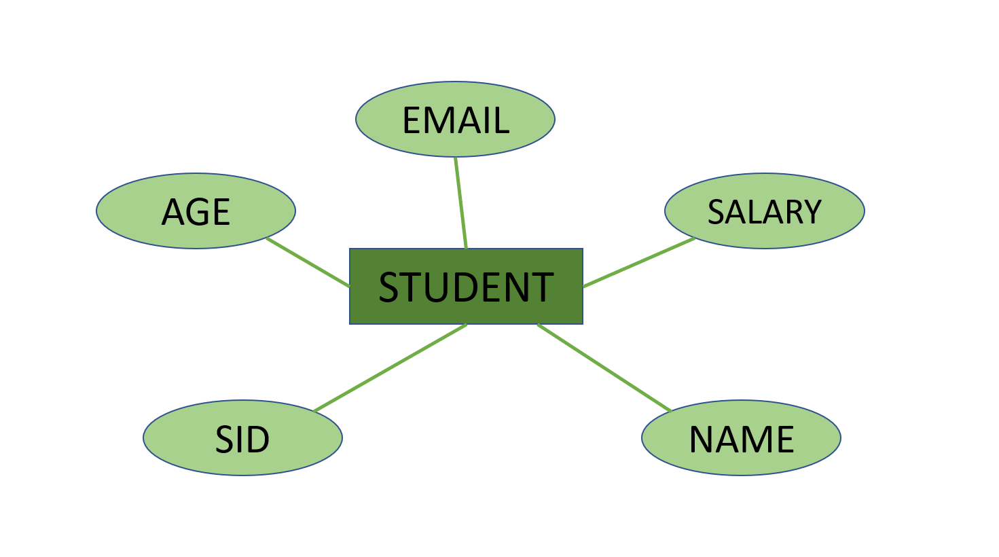
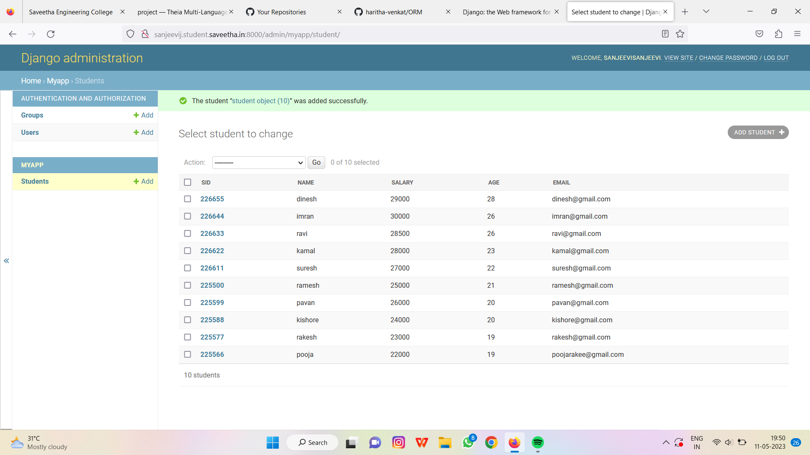

# Ex02 Django ORM Web Application

## AIM
To develop a Django application to store and retrieve data from a student database using Object Relational Mapping(ORM).

## Entity Relationship Diagram

Include your ER diagram here

## DESIGN STEPS

## STEP 1:
clone the repository from github.
## STEP 2:
create an admin interface for django.
## STEP 3:
create an app and edit settings.py
## STEP 4:
make migrations and migrate the changes.
## STEP 5:
create admin user and write python code for admin and models.
## STEP 6:
make all the migrations to 'myapp'.
## STEP 7:
create an student database with 10 fields using runserver command.
## PROGRAM
'''
admin.py

from django.contrib import admin
from .models import student,studentAdmin
admin.site.register(student,studentAdmin)

models.py

from django.db import models
from django.contrib import admin
class student(models.Model):
    sid=models.CharField(max_length=200)
    name=models.CharField(max_length=100)
    salary=models.IntegerField()
    age=models.IntegerField()
    email=models.EmailField()

class studentAdmin(admin.ModelAdmin):
    list_display=('sid','name','salary','age','email')
    '''
## OUTPUT

## RESULT
The program for creating an student database using ORM is executed sucessfully.